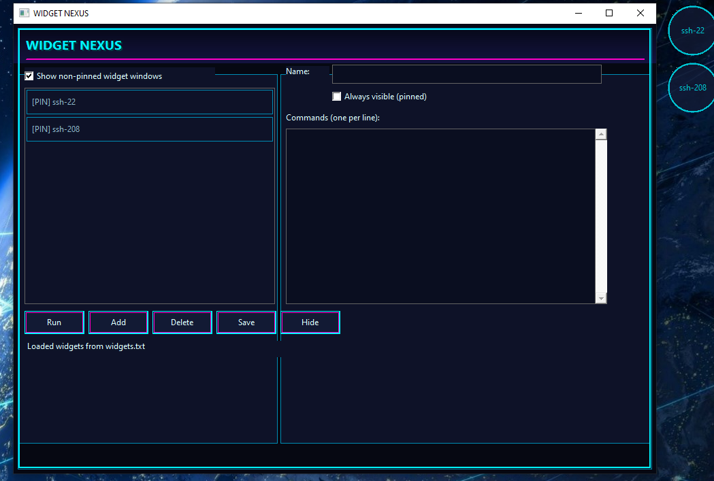
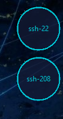
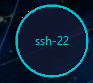
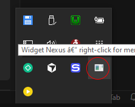

# Widget Nexus (WidgetLauncherCpp)

A small **Windows** utility in **C++ / Win32** for defining **widgets**: each widget runs one or more shell commands when activated. The **Nexus** window is where you edit and save definitions; each widget also appears as a **circular floating desktop control** (no .NET, no extra UI frameworks).

## Project status

This app is **currently under development**—expect rough edges and changes. We are also working on a **Linux** version.

---

## Screenshots








---

## Features

- **Widget Nexus** — Dark **neon / synthwave** editor: owner-drawn list and buttons, themed fields via `SetWindowTheme` (`uxtheme`).
- **Per-widget desktop floaters** — Small **circular**, **semi-transparent** (`WS_EX_LAYERED`) tool windows; **only the name** is drawn. **Click the inner disk** to run commands; **drag the outer ring** to move.
- **Layout** — Floaters **auto-arrange** on the **primary monitor work area**, starting **top-right**, filling **top → bottom** per column, then stepping **right → left** for the next column. Relayout on **`WM_DISPLAYCHANGE`**.
- **Pinned widgets** — `alwaysVisible=1` sets the floater **always-on-top** (`WS_EX_TOPMOST`). This applies to the **floater**, not the Nexus.
- **Hide Nexus** — Hides the editor; **tray icon** appears. **Double-click** tray or **Show Nexus** in the menu restores it. **Exit** closes the app and floaters.
- **Show non-pinned widget windows** — Toggles visibility of floaters for widgets that are **not** pinned.
- **No run popup** — Command output is **not** shown in a message box; status text updates in the Nexus when it is visible.
- **Persistence** — All definitions saved to **`widgets.txt`** next to the executable (or current working directory, depending on how you launch the app).

---

## Requirements

- **Windows** 10 or later (recommended).
- **MinGW-w64** (GCC) with Win32 headers, or **MSVC** with equivalent settings.
- **Code::Blocks** (optional) — project file `WidgetLauncherCpp.cbp` included.

---

## Build

### Code::Blocks

1. Open `WidgetLauncherCpp.cbp`.
2. Select **Debug** or **Release**.
3. **Build** → **Build and run** (or **Rebuild** after pulling changes).

Linker libraries used: **`comctl32`**, **`uxtheme`**, **`msimg32`** (for `GradientFill` / luxury panel gradients).

The project also passes **`-static`** to the linker so MinGW-w64 runtimes (including **`libwinpthread`**) are embedded in the `.exe`. Without that, Windows looks for **`libwinpthread-1.dll`** whenever MinGW’s `bin` folder is not on `PATH` (e.g. double‑clicking the program outside Code::Blocks).

### Command line (MinGW)

From this directory:

```bash
g++ -std=c++17 -Wall -O2 -mwindows -static main.cpp -lcomctl32 -luxtheme -lmsimg32 -o WidgetLauncherCpp.exe
```

Place `widgets.txt` beside `WidgetLauncherCpp.exe` if you want the app to load/save config from the same folder as the binary.

---

## Configuration (`widgets.txt`)

Plain text, one block per widget:

```txt
[Widget]
name=My Widget
alwaysVisible=0
command=echo hello
command=echo second step
```

| Key | Meaning |
|-----|--------|
| `name` | Display name (Nexus list + floater title / paint). |
| `alwaysVisible` | `1` = pinned (always-on-top floater); `0` = not pinned. |
| `command` | One shell line per `command=` row; executed **in order** via `cmd.exe /C` (non-interactive). |

**Interactive commands** (e.g. **WSL**, **SSH**, **`wt.exe`**) are detected and launched in a **new visible console** (`cmd.exe /K …`) so prompts (e.g. SSH password) work.

Example (WSL + SSH):

```txt
[Widget]
name=SSH on WSL
alwaysVisible=1
command=wsl.exe -e bash -lc "ssh user@server"
```

> **Tip:** Prefer `wsl.exe` over `wt.exe` for portability; `wt.exe` is not always on `PATH` for every host process.

---

## Project layout

| File | Role |
|------|------|
| `main.cpp` | Application entry, Nexus UI, floater windows, tray, layout, I/O. |
| `WidgetLauncherCpp.cbp` | Code::Blocks project. |
| `widgets.txt` | User widget definitions (created from defaults if missing). |
| `README.md` | This file. |
| `LICENSE` | MIT license text. |
| `docs/images/` | Screenshot assets referenced in this README. |
| `linx-dst/` | **GTK 3** Linux/Ubuntu port (`CMake`). Same `widgets.txt` format; see `linx-dst/README.md`. |

---

## Usage (quick)

1. Run **WidgetLauncherCpp.exe**.
2. Select a widget in the list, edit **name**, **always visible**, and **commands** (one per line).
3. Click **Save** to write `widgets.txt`.
4. Click a **circular floater** (center) to run; drag the **rim** to reposition (layout is reapplied on add/remove/display change, not every drag).
5. **Hide** hides the Nexus; use the **tray** to show it again or exit.

---

## License

This project is released under the [MIT License](LICENSE).

---

## Credits

Built with the Win32 API: `CreateWindow`, `GDI`, `Shell_NotifyIcon`, layered windows (`SetLayeredWindowAttributes`), and `SetWindowRgn` for circular floaters.

This app was developed using [Cursor](https://cursor.com) (Cursor IDE).
